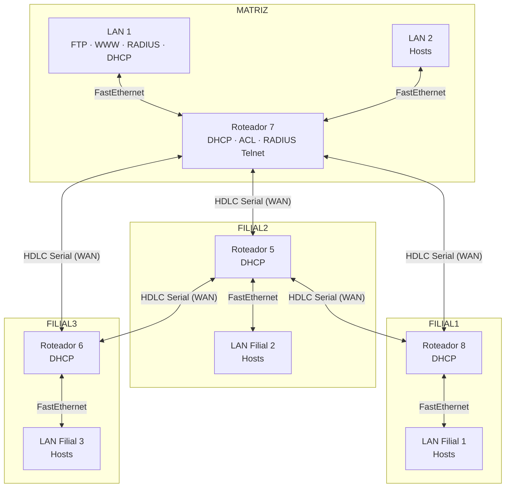
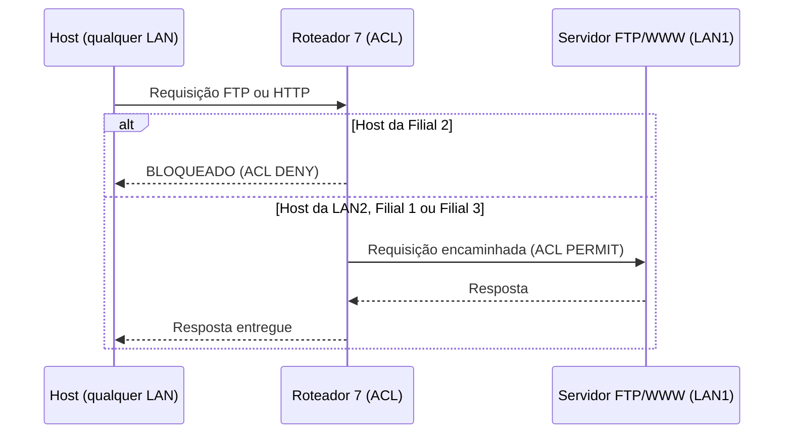
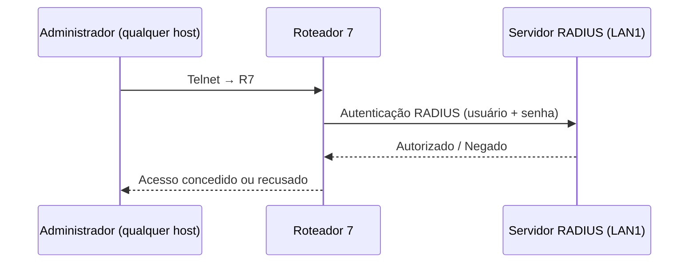

<div align="center">

# NetMesh

**Simulação de rede corporativa com matriz e filiais — Cisco Packet Tracer**

Projeto acadêmico que implementa uma infraestrutura de rede TCP/IP completa, com roteamento dinâmico RIP v2, DHCP, controle de acesso via ACL, serviços FTP/WWW e autenticação RADIUS via Telnet.

Desenvolvido por alunos da disciplina de **Segurança de Sistemas Computacionais**.


</div>

---

## Sobre o Projeto

### Problema resolvido

Redes corporativas reais exigem planejamento cuidadoso de endereçamento, roteamento, segurança e disponibilidade de serviços entre unidades geograficamente distribuídas. Este projeto simula esse cenário de forma fiel, permitindo a aplicação prática dos conceitos de sub-redes, protocolos de roteamento, políticas de acesso e serviços de rede.

### Objetivo

Projetar e implementar, no Cisco Packet Tracer, a infraestrutura lógica de uma empresa com uma matriz e três filiais, garantindo:

- Comunicação plena entre todas as interfaces da rede
- Distribuição automática de endereços via DHCP
- Roteamento dinâmico entre todos os roteadores
- Controle de acesso granular a serviços (FTP e WWW)
- Autenticação centralizada para acesso Telnet ao roteador principal

### Público-alvo

Estudantes e professores de Redes de Computadores que desejam estudar ou avaliar um cenário completo de rede corporativa simulada.

---

## Arquitetura em Alto Nível

A rede é composta por uma **matriz** com duas LANs e três **filiais**, cada uma com uma LAN. Os roteadores se interconectam via WAN em topologia de **malha parcialmente interligada**.



### Topologia WAN

A malha parcialmente interligada conecta os quatro roteadores com **5 enlaces seriais HDLC**:

```
R7 ── R8
R7 ── R5
R7 ── R6
R5 ── R8
R5 ── R6
```

---

## Camadas utilizadas na construção da arquitetura de redes

| Camada | Tecnologia |
|---|---|
| Simulação | Cisco Packet Tracer 9.x |
| Protocolo de rede | TCP/IP — Classe C (`201.222.5.0/24`) |
| Sub-redes LAN | Máscara `/29` — 6 hosts úteis por LAN |
| Sub-redes WAN | Máscara `/30` — 2 hosts úteis por enlace |
| Roteamento | RIP versão 2 |
| Enlace WAN | HDLC (Serial DCE/DTE) |
| Enlace LAN | FastEthernet (switches 2950/2960) |
| Endereçamento dinâmico | DHCP (configurado nos roteadores) |
| Serviços | FTP, HTTP/WWW |
| Controle de acesso | ACL (Access Control List) no Roteador 7 |
| Autenticação | RADIUS (acesso Telnet ao Roteador 7) |

---

## Plano de Endereçamento

### Sub-redes LAN (`/29` — 8 IPs, 6 úteis)

| Sub-rede | Endereço de rede | Faixa de hosts | Broadcast | Localização |
|---|---|---|---|---|
| LAN 1 — Matriz | `201.222.5.0/29` | `.1` – `.6` | `.7` | Roteador 7 |
| LAN 2 — Matriz | `201.222.5.8/29` | `.9` – `.14` | `.15` | Roteador 7 |
| LAN — Filial 1 | `201.222.5.16/29` | `.17` – `.22` | `.23` | Roteador 8 |
| LAN — Filial 2 | `201.222.5.24/29` | `.25` – `.30` | `.31` | Roteador 5 |
| LAN — Filial 3 | `201.222.5.32/29` | `.33` – `.38` | `.39` | Roteador 6 |

### Sub-redes WAN (`/30` — 4 IPs, 2 úteis)

| Sub-rede | Endereço de rede | Hosts | Enlace |
|---|---|---|---|
| WAN 1 | `201.222.5.40/30` | `.41` / `.42` | R7 ↔ R8 |
| WAN 2 | `201.222.5.44/30` | `.45` / `.46` | R7 ↔ R5 |
| WAN 3 | `201.222.5.48/30` | `.49` / `.50` | R7 ↔ R6 |
| WAN 4 | `201.222.5.52/30` | `.53` / `.54` | R5 ↔ R8 |
| WAN 5 | `201.222.5.56/30` | `.57` / `.58` | R5 ↔ R6 |

---

## Pré-requisitos

| Ferramenta | Versão mínima | Finalidade |
|---|---|---|
| [Cisco Packet Tracer](https://www.netacad.com/courses/packet-tracer) | 9.0 | Abertura e execução da simulação |

> Não são necessárias ferramentas adicionais. Todo o projeto é autocontido no arquivo `.pkt`.

---

## Como Executar

### 1. Clone o repositório

```bash
git clone https://github.com/seu-org/netmesh.git
cd netmesh
```

### 2. Abra o arquivo de simulação

```bash
# Abra o Cisco Packet Tracer e carregue o arquivo
File → Open → cybersecurity.pkt
```

### 3. Verifique o funcionamento

Após abrir, aguarde a convergência do RIP v2 (alguns segundos em modo Realtime) e teste:

```bash
# Em qualquer PC da rede, abra o Command Prompt e execute:
ping <IP-de-destino>

# Para testar FTP (de LAN2, Filial 1 ou Filial 3):
ftp 201.222.5.1

# Para testar bloqueio de acesso (da Filial 2 — deve falhar):
ftp 201.222.5.1

# Para testar Telnet ao R7 com autenticação RADIUS:
telnet 201.222.5.1
```

---

## Estrutura do Repositório

```text
netmesh/
├── cybersecurity.pkt    # Arquivo principal do Packet Tracer (topologia + configs)
├── docs/
│   ├── endereçamento.md # Plano completo de sub-redes e IPs
│   ├── topologia.png    # Diagrama da topologia física/lógica
│   └── configuracoes.md # Comandos CLI utilizados nos roteadores
└── README.md
```

---

## Fluxo de Acesso aos Serviços





---

## Políticas de Acesso (ACL)

Configuradas no **Roteador 7**, interface voltada para a WAN:

| Origem | FTP (LAN1) | WWW (LAN1) |
|---|---|---|
| LAN 2 — Matriz | ✅ Permitido | ✅ Permitido |
| LAN — Filial 1 | ✅ Permitido | ✅ Permitido |
| LAN — Filial 2 | ❌ Bloqueado | ❌ Bloqueado |
| LAN — Filial 3 | ✅ Permitido | ✅ Permitido |

---

## Mantenedores

| Nome | GitHub |
|---|---|
| Matheus Ryan | [@TETEURYAN](https://github.com/usuario) |
| Taísa Lima | [@TaisaLima](https://github.com/TaisaLima) |
| Ruan Tenório | [@ruantmelo](https://github.com/ruantmelo) |
